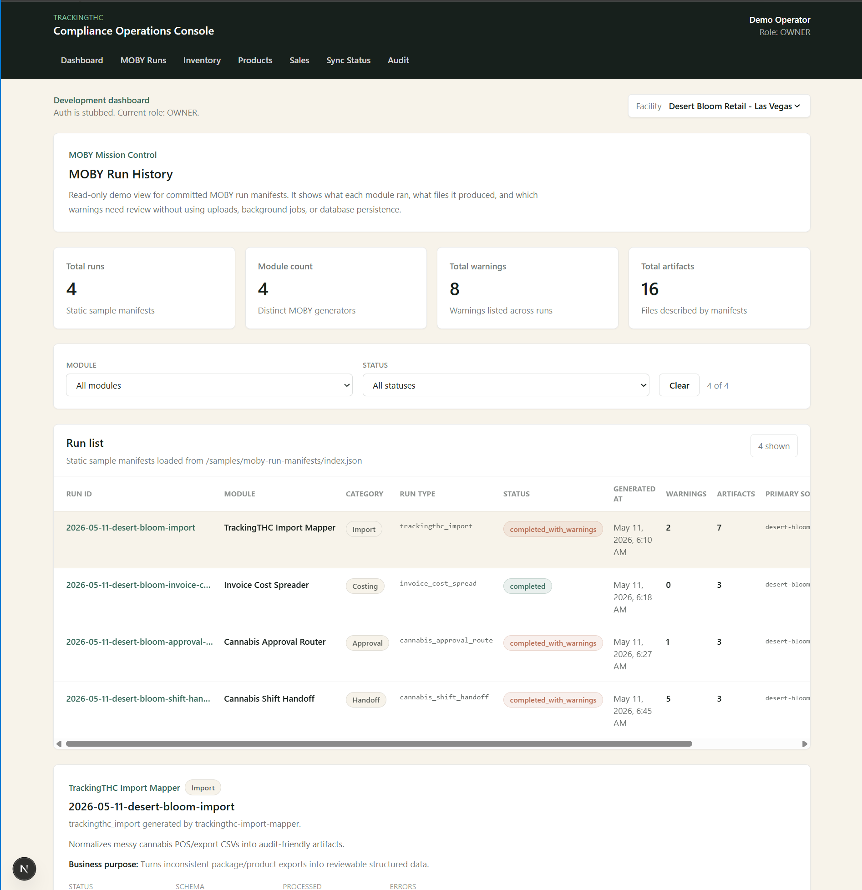

# TrackingTHC

TrackingTHC is a cannabis retail operations prototype for exploring package cost visibility, import review, audit trails, reconciliation workflows, and compliance-adjacent data review.

It is **not** a full point-of-sale system, and it is **not** production SaaS yet. This repo is a portfolio/demo app shell for proving a practical idea:

> Messy cannabis operations data can be turned into structured, reviewable artifacts that operators, finance teams, and technical teams can actually understand.

The current demo surfaces are:

- `/moby-runs` — MOBY Mission Control, a static run-manifest viewer.
- `/import-review` — a static MOBY import sidecar viewer.
- Older operational prototype pages for inventory, products, sales, audit, and fake Metrc sync concepts.

## MOBY Mission Control

TrackingTHC includes a static demo viewer for MOBY run manifests at:

```text
/moby-runs
```

MOBY Mission Control reads committed sample `moby-run-manifest.json` files and displays:

- what each module ran
- which source files were used
- which artifacts were produced
- which warnings need review
- how each run fits into the broader MOBY module ecosystem

The current demo uses a fictional **Desert Bloom Retail - Las Vegas** scenario across four MOBY-compatible modules:

| Module | Category | Purpose |
|---|---|---|
| `trackingthc-import-mapper` | Import / Data Normalization | Normalizes messy POS/package exports into reviewable artifacts. |
| `invoice-cost-spreader` | Costing / COGS | Allocates invoice-level costs and discounts for landed-cost review. |
| `cannabis-approval-router` | Approvals / Decision Routing | Routes operational approval requests with evidence-aware warnings. |
| `cannabis-shift-handoff` | Handoffs / Operational Memory | Turns messy shift notes into structured follow-up items. |

The viewer is intentionally read-only and static for this slice. It does not use uploads, background jobs, API ingestion, local folder scanning, or database persistence.



## What `/moby-runs` shows

The MOBY Run History viewer loads committed sample manifests from:

```text
public/samples/moby-run-manifests/
```

It also loads static module display metadata from:

```text
public/samples/moby-module-registry.json
```

The page displays:

- Run metadata: `runId`, `runType`, `generatedBy`, `status`, and `generatedAt`
- Summary counts: total runs, module count, warning count, and artifact count
- Friendly module labels, categories, descriptions, and business purpose
- Source info: system, source file name, source path, and received timestamp
- Artifacts: label, role, format, path, and artifact ID
- Warnings: severity, code, field, row number, linked artifact, and message
- Compact metadata for the selected run
- Module and status filters for exploring the demo data

The module registry is display metadata only. It does not replace `moby-run-manifest.json`, and unknown modules still render using manifest data.

## `/import-review` MOBY JSON Sidecar Viewer

The Import Review Viewer loads a sample MOBY sidecar from:

```text
public/samples/moby-import-example.json
```

Local route:

```text
/import-review
```

The viewer displays:

- Schema metadata: `schemaVersion`, `generatedBy`, and `generatedAt`
- Import summary: run ID, source, status, row count, warning count, package count, and source file
- Mapping profile: source fields, canonical MOBY fields, and mapping status
- Validation issues: severity, code, field, row number, and message
- Packages: package label, product name, quantity, unit cost, total cost, and vendor

## Viewer difference

`/import-review` and `/moby-runs` are related, but they answer different questions.

| Route | Reads | Focus |
|---|---|---|
| `/import-review` | `moby-import.json` | One import workflow: mappings, validation issues, packages, and sidecar contents. |
| `/moby-runs` | `moby-run-manifest.json` | Run history across MOBY modules: run metadata, sources, artifacts, warnings, and summary counts. |

Neither route stores uploaded files or writes database records in the current demo slice.

## MOBY-compatible module pattern

A MOBY-compatible module does useful work, writes its normal output artifact, and emits a `moby-run-manifest.json` receipt describing the run.

The pattern is intentionally boring:

1. Preserve existing behavior.
2. Add explicit artifact output mode when needed.
3. Write the module's normal result artifact unchanged.
4. Write `moby-run-manifest.json` next to it.
5. Keep module-specific business logic inside the module.
6. Use `moby-core` as the shared contract language.
7. Avoid surprise file output.
8. Test both old behavior and run-output behavior.

Current aligned modules:

| Module | Role | MOBY artifact behavior |
|---|---|---|
| `moby-core` | Shared TypeScript contracts | Defines run manifest, artifact, warning, source, summary, audit/workflow, and domain types. |
| `trackingthc-import-mapper` | Data normalization | Emits normalized import outputs and `moby-run-manifest.json`. |
| `invoice-cost-spreader` | Cost allocation / COGS | Emits `spread-result.json` and `moby-run-manifest.json`. |
| `cannabis-approval-router` | Approval decision routing | Emits `approval-result.json` and `moby-run-manifest.json`. |
| `cannabis-shift-handoff` | Operational handoff memory | Emits handoff output and `moby-run-manifest.json`. |

## Ecosystem architecture

TrackingTHC is the viewer/app shell for the MOBY demo ecosystem.

```text
moby-core
  -> trackingthc-import-mapper
  -> invoice-cost-spreader
  -> cannabis-approval-router
  -> cannabis-shift-handoff
  -> trackingthc.com
```

- `moby-core` defines the shared contracts and vocabulary.
- MOBY-compatible modules emit `moby-run-manifest.json` files that describe module runs, sources, artifacts, warnings, and summary counts.
- `trackingthc-import-mapper` also emits `moby-import.json` sidecars for import review.
- `trackingthc.com` consumes committed sample sidecars and run manifests and displays them for review, audit prep, and future reconciliation workflows.

This repo should not need to understand each module's internals. It only needs versioned artifacts and manifest contracts.

## Demo routes

| Route | Description |
|---|---|
| `/dashboard` | Main operational dashboard. |
| `/moby-runs` | Static MOBY run manifest viewer / Mission Control. |
| `/import-review` | Static import sidecar review page. |
| `/inventory` | Inventory-oriented demo pages. |
| `/products` | Product-oriented demo pages. |
| `/sales` | Sales demo page. |
| `/sync-status` | Sync status demo page. |
| `/audit` | Audit trail demo page. |

## Current status

- Static/client-side import review is working.
- Static/client-side MOBY run history is available at `/moby-runs`.
- `/moby-runs` uses a connected Desert Bloom Retail demo scenario.
- `/moby-runs` loads static module registry metadata for friendly labels and categories.
- No auth is required for `/import-review` or `/moby-runs`.
- No database setup is required for `/import-review` or `/moby-runs`.
- The pages currently use bundled samples rather than upload flows, local folder scanning, or persisted import history.

## Static sample files

Sample MOBY run manifests live in:

```text
public/samples/moby-run-manifests/
```

Module display metadata lives in:

```text
public/samples/moby-module-registry.json
```

Sample MOBY import sidecar lives at:

```text
public/samples/moby-import-example.json
```

These files power the demo pages without requiring database setup.

## Local development

Install dependencies:

```powershell
npm install
```

Start the dev server:

```powershell
npm run dev
```

Open the app:

```text
http://localhost:3000
```

Open MOBY Mission Control directly:

```text
http://localhost:3000/moby-runs
```

Open the Import Review Viewer directly:

```text
http://localhost:3000/import-review
```

## Verification

Run the local checks:

```powershell
npm run typecheck
npm run lint
npm run build
```

## Tech stack

- Next.js App Router
- React
- TypeScript
- Tailwind CSS
- Prisma/PostgreSQL for earlier operational prototype areas
- Static JSON samples for the current MOBY demo slice

## Current scope

This project is a portfolio/demo prototype. The MOBY Mission Control page currently reads committed static sample files from `public/samples/`. It is not yet a production ingestion system.

Intentionally not included in this slice:

- Upload flows
- Background jobs
- API ingestion for run manifests
- Database persistence for MOBY runs
- Auth changes
- File-system scanning of generated run folders
- A full POS workflow
- A production compliance integration

## Roadmap

Near-term ideas:

- Keep improving the `/moby-runs` demo experience.
- Add more screenshots and demo notes for the MOBY workflow.
- Create one generated end-to-end sample chain from real module outputs.
- Add a sample selector for multiple generated MOBY sidecars.
- Add a manifest selector or local-file review mode for MOBY run history.
- Explore a database-backed MOBY run history only after the static demo proves the workflow.

Future workflow ideas:

- Reconciliation prep workflow
- Finance review workflow
- Package cost review workflow
- Approval trail review workflow
- Shift handoff review workflow

## Why this exists

Cannabis retail operations generate messy data across POS exports, invoices, approvals, shift notes, compliance systems, and human workflows.

TrackingTHC explores a small, practical path toward making those workflows more visible, auditable, and explainable.

MOBY is the guide dog for the chaos: it does not replace the operator, but it leaves clean paw-print receipts for what happened.
